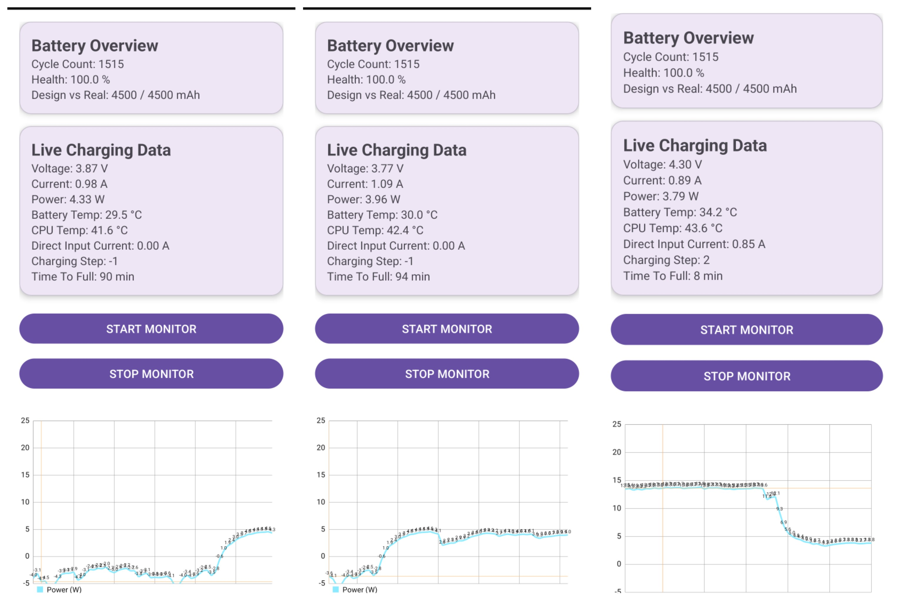

# 🔋 ChargingMonitorOverlay

Advanced Android battery telemetry monitor with root access.

Reads raw kernel battery data directly from:

```
/sys/class/power_supply/
```

Displays real low-level battery telemetry in human-readable form.

Designed for power users, engineers, and telemetry enthusiasts.



---

# 🚀 Features

## 📊 Battery Overview
- Cycle count
- Real health calculation (Full vs Design capacity)
- Design vs actual capacity (mAh)

## ⚡ Live Charging Data
- Voltage (V)
- Current (A)
- Power (W)
- Battery temperature (°C)
- CPU temperature (°C)
- Direct charging input current
- Charging step detection
- Time to full (minutes)

## 📈 Live Power Graph
- Real-time charge / discharge visualization
- Positive values = charging
- Negative values = discharging
- Automatic scaling
- Smoothed watt history

## 🧠 Smart Detection
- Auto-detects:
  - `current_now`
  - `batt_current_ua_now`
- Automatic µA / mA conversion
- Samsung-specific kernel node handling
- Direct charging node support

---

# 📦 Requirements

- Android 8.0+ (API 26+)
- Root access (Magisk recommended)
- Kernel exposing `/sys/class/power_supply/battery/`

Tested on Samsung devices with OneUI + Magisk.

---

# 🛠 Installation

## Option 1 — Build from Source

```bash
git clone https://github.com/AfroUSApl/ChargingMonitorOverlay.git
cd ChargingMonitorOverlay
./gradlew assembleDebug
```

APK will be generated in:

```
app/build/outputs/apk/debug/
```

Install manually:

```bash
adb install app-debug.apk
```

---

## Option 2 — Direct APK

Download the latest release from the GitHub Releases section.

---

# 🔐 Root Permission

On first start:

1. Tap **Start Monitor**
2. Grant root permission in Magisk
3. Telemetry starts updating live

If root is denied → kernel values will not update.

---

# 📁 Kernel Data Source

The app reads directly from:

```
/sys/class/power_supply/battery/
```

Common nodes used:

- `current_now`
- `batt_current_ua_now`
- `voltage_now`
- `power_now`
- `batt_temp`
- `battery_cycle`
- `charge_full`
- `charge_full_design`
- `time_to_full_now`
- `direct_charging_iin`

---

# 📊 Data Interpretation

| Value | Meaning |
|--------|----------|
| Positive current | Charging |
| Negative current | Discharging |
| Power (W) | Voltage × Current |
| Health % | charge_full / charge_full_design |
| Time To Full | Remaining charge time (minutes) |

---

# ⚠ Notes

- Some manufacturers lock real capacity values.
- Health 100% does not always mean zero degradation.
- CPU temperature location may vary by device.
- Power values fluctuate rapidly (normal behavior).
- Some kernels expose multiple current nodes — auto-detection handles this.

---

# 🧾 Changelog

## 🟢 v1.0
- Basic voltage & current display
- Root-based sysfs reading

## 🟢 v1.5
- Added power calculation
- Added charging detection

## 🟢 v1.9
- Smart kernel unit detection
- µA / mA auto scaling
- Safe fallback handling

## 🟢 v2.0
- Foreground service support
- Status notification
- Basic monitoring controls

## 🟢 v2.1
- Improved root handling
- Fixed incorrect scaling issues

## 🟢 v3.0
- Full telemetry dashboard
- Battery overview section
- Health calculation
- Direct charging input detection
- Charging step detection
- Time-to-full reading

## 🟢 v3.1
- Material card UI redesign
- CPU temperature added
- Human-readable unit conversion
- Live power graph
- Improved smoothing

## 🟢 v3.5
- Watt history smoothing
- Charge/discharge detection logic refined
- Stability improvements

## 🟢 v3.10
- Better Samsung node compatibility
- Auto-detect `batt_current_ua_now`
- Improved health calculation accuracy

## 🟢 v3.15
- Graph scaling improvements
- Smarter negative/positive power handling
- UI polish & stability fixes
- Optimized background handler

## 🟢 v3.16
- Adaptive launcher icon support
- Graph rendering stability improvements
- Improved Samsung kernel node handling
- Better fallback logic for missing power nodes
- Minor performance optimizations
- Project cleanup

---

# 📌 Roadmap

- Per-cycle degradation tracking
- CSV logging export
- Multi-line telemetry graph
- Charging phase detection (CC / CV)
- Efficiency calculation
- Thermal throttling alerts

---

# 👨‍💻 Author

Thomas  
Built for power users who want real battery telemetry.

---

# 📜 License

MIT License